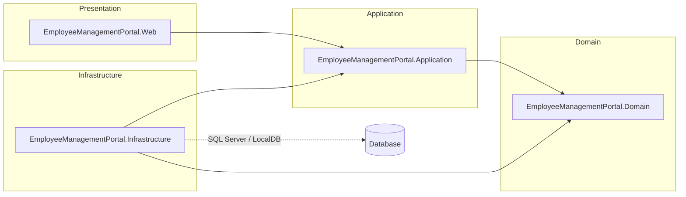

# Employee Management Portal

A production-ready **ASP.NET MVC (.NET 8)** reference application implementing
**Clean Architecture**, the **Repository Pattern**, **Dependency Injection** and
**FluentValidation**. It is shipped with an enterprise-grade CI/CD pipeline that
runs unit tests, enforces ≥ 85% code coverage, performs SonarQube + CodeQL security
scans, and deploys to Azure App Service.

## Features

- CRUD over the `Employee` aggregate (Create, Read, Update, Delete, List).
- Field-level FluentValidation rules (length, format, range, business constraints).
- Uniqueness enforcement on `EmployeeCode` and `Email`.
- Razor views with Bootstrap styling, anti-forgery tokens on all POSTs.

## Solution layout

```
src/
  EmployeeManagementPortal.Domain/          # Pure entities (zero dependencies)
  EmployeeManagementPortal.Application/     # Use cases, DTOs, validators, mappers
  EmployeeManagementPortal.Infrastructure/ # EF Core (SQL Server), repositories
  EmployeeManagementPortal.Web/            # MVC controllers + Razor views
tests/
  EmployeeManagementPortal.Tests/          # xUnit + Moq + FluentAssertions
.github/
  workflows/ci-cd.yml                      # 6-stage pipeline
  agents/                                  # Reusable AI agents
docs/                                      # Architecture, sequence & deployment diagrams
scripts/                                   # Local run-scripts for tests & agents
sonar-project.properties                   # SonarQube project configuration
```

## Architecture



See [docs/architecture.md](docs/architecture.md) for the full description and
[docs/sequence-create-employee.md](docs/sequence-create-employee.md) for the
Create Employee interaction.

## Employee schema

| Field | Type | Constraints |
|---|---|---|
| Id | int | PK, identity |
| EmployeeCode | string(32) | Required, unique, alphanumeric + `-`/`_` |
| FirstName | string(64) | Required |
| LastName | string(64) | Required |
| Email | string(254) | Required, unique, valid email |
| Department | string(64) | Required |
| Salary | decimal(18,2) | ≥ 0, ≤ 10 000 000 |
| DateOfJoining | date | Required, not in the future |
| CreatedAt | datetime2 | Audit (UTC) |
| UpdatedAt | datetime2? | Audit (UTC, nullable) |

## Quick start

```bash
git clone https://github.com/your-org/EmployeeManagementPortal.git
cd EmployeeManagementPortal

# Restore + build
dotnet restore EmployeeManagementPortal.sln
dotnet build EmployeeManagementPortal.sln

# Run tests with coverage
bash scripts/run-tests.sh    # or .\scripts\run-tests.ps1 on Windows

# Run the web app
dotnet run --project src/EmployeeManagementPortal.Web
```

Open <https://localhost:5001> (or the URL printed in the console).

## Tests

```bash
dotnet test tests/EmployeeManagementPortal.Tests/EmployeeManagementPortal.Tests.csproj
```

Tests cover:

- Controller actions (`EmployeesControllerTests`)
- Service orchestration (`EmployeeServiceTests`)
- Repository persistence (`EmployeeRepositoryTests`, in-memory EF)
- FluentValidation rules (`CreateEmployeeDtoValidatorTests`, `UpdateEmployeeDtoValidatorTests`)
- Mappers (`EmployeeMapperTests`)
- Result helper (`ResultTests`)

Coverage is exported as `coverage.cobertura.xml` and `coverage.opencover.xml` and an HTML
report under `coverage-report/`.

## CI/CD pipeline

The pipeline at `.github/workflows/ci-cd.yml` runs six stages:

1. **Build** — restore, build, publish build artifact.
2. **Test + Coverage** — run xUnit, generate coverage, fail if < 85%, run the **Coverage Analysis Agent**.
3. **SonarQube** — analyse with Sonar Scanner, run the **Sonar Security Agent**, fail on Quality Gate ≠ OK.
4. **CodeQL** — scan C# code, run the **Security Analysis Agent**.
5. **AI Code Review** — run the **Enterprise Code Review Agent** combining all signals.
6. **Deploy** — publish and deploy to Azure App Service (main branch only).

See [docs/ci-cd-flow.md](docs/ci-cd-flow.md) for the visual flow.

## AI agents

Reusable scripts live under `.github/agents/` and can be invoked locally via Node 18+:

- `CoverageAnalysisAgent` — `node .github/agents/CoverageAnalysisAgent/coverage-analysis-agent.mjs`
- `SonarSecurityAgent` — `node .github/agents/SonarSecurityAgent/sonar-security-agent.mjs`
- `SecurityAnalysisAgent` — `node .github/agents/SecurityAnalysisAgent/security-analysis-agent.mjs`
- `EnterpriseCodeReviewAgent` — `node .github/agents/EnterpriseCodeReviewAgent/enterprise-code-review-agent.mjs`

## Required GitHub secrets

| Secret | Purpose |
|---|---|
| `SONAR_TOKEN` | Auth token for SonarQube. |
| `SONAR_HOST_URL` | SonarQube base URL (e.g. `https://sonar.example.com`). |
| `GITHUB_TOKEN` | Provided by Actions; used for PR/issue comments and SARIF upload. |
| `AZURE_WEBAPP_PUBLISH_PROFILE` | Publish profile XML from the Azure Web App. |

## Sample reports

The `docs/sample-reports/` folder contains reference reports produced by the AI agents.

## License

MIT — see [LICENSE](LICENSE).