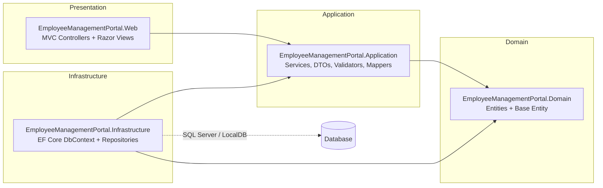

# Employee Management Portal — Architecture

This project follows **Clean Architecture** with strict separation of concerns. Dependencies only
point inward (Infrastructure → Application → Domain), keeping the Domain layer free of frameworks.

## High-level overview

## Layer responsibilities

| Layer | Project | Responsibility |
|---|---|---|
| Domain | `EmployeeManagementPortal.Domain` | Pure entities and base classes; zero dependencies. |
| Application | `EmployeeManagementPortal.Application` | Use cases, DTOs, validators, mappers, service contracts. |
| Infrastructure | `EmployeeManagementPortal.Infrastructure` | EF Core `DbContext`, repository implementations, dependency wiring. |
| Web | `EmployeeManagementPortal.Web` | MVC controllers, Razor views, DI composition root. |
| Tests | `EmployeeManagementPortal.Tests` | xUnit tests for all of the above. |