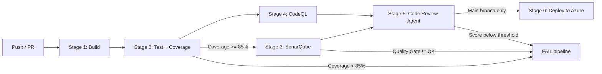

# CI/CD Flow

```mermaid
flowchart LR
    A[Push / PR] --> B[Stage 1: Build]
    B --> C[Stage 2: Test + Coverage]
    C -->|Coverage >= 85%| D[Stage 3: SonarQube]
    C --> E[Stage 4: CodeQL]
    D --> F[Stage 5: Code Review Agent]
    E --> F
    F -->|Main branch only| G[Stage 6: Deploy to Azure]
    C -->|Coverage < 85%| X[FAIL pipeline]
    D -->|Quality Gate != OK| X
    F -->|Score below threshold| X
```