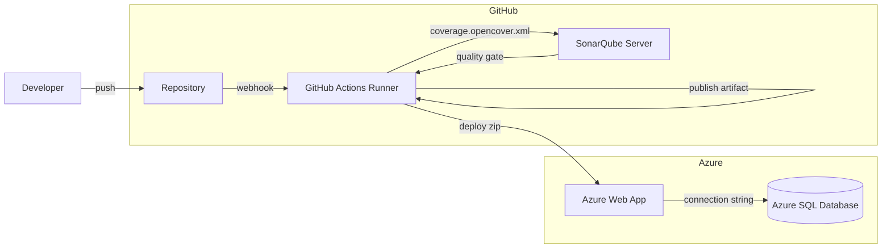

# Deployment Diagram

```mermaid
flowchart LR
    Dev[Developer]
    subgraph GitHub
        Repo[Repository]
        Actions[GitHub Actions Runner]
        Sonar[SonarQube Server]
    end
    subgraph Azure
        WebApp[Azure Web App]
        DB[(Azure SQL Database)]
    end

    Dev -- push --> Repo
    Repo -- webhook --> Actions
    Actions -- dotnet build/test --> Actions
    Actions -- coverage.opencover.xml --> Sonar
    Sonar -- quality gate --> Actions
    Actions -- publish artifact --> Actions
    Actions -- deploy zip --> WebApp
    WebApp -- connection string --> DB
```