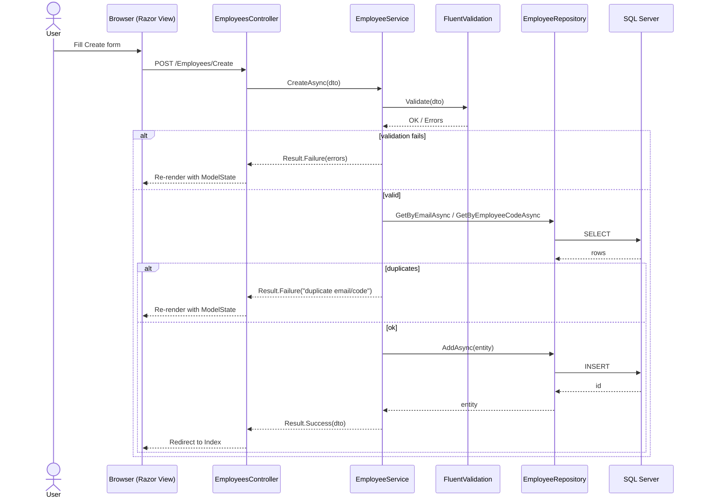

# Sequence — Create Employee

```mermaid
sequenceDiagram
    actor User
    participant V as Browser (Razor View)
    participant C as EmployeesController
    participant S as EmployeeService
    participant V2 as FluentValidation
    participant R as EmployeeRepository
    participant DB as SQL Server

    User->>V: Fill Create form
    V->>C: POST /Employees/Create
    C->>S: CreateAsync(dto)
    S->>V2: Validate(dto)
    V2-->>S: OK / Errors
    alt validation fails
        S-->>C: Result.Failure(errors)
        C-->>V: Re-render with ModelState
    else valid
        S->>R: GetByEmailAsync / GetByEmployeeCodeAsync
        R->>DB: SELECT
        DB-->>R: rows
        alt duplicates
            S-->>C: Result.Failure("duplicate email/code")
            C-->>V: Re-render with ModelState
        else ok
            S->>R: AddAsync(entity)
            R->>DB: INSERT
            DB-->>R: id
            R-->>S: entity
            S-->>C: Result.Success(dto)
            C-->>V: Redirect to Index
        end
    end
```